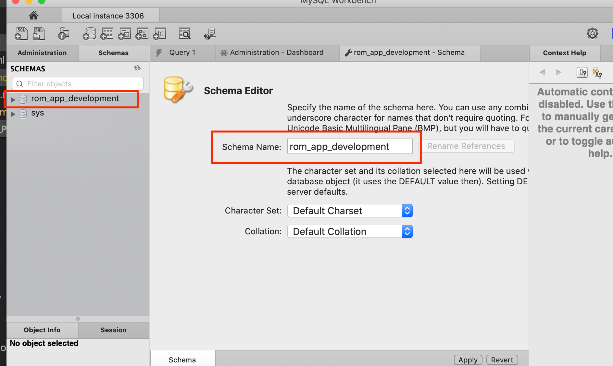
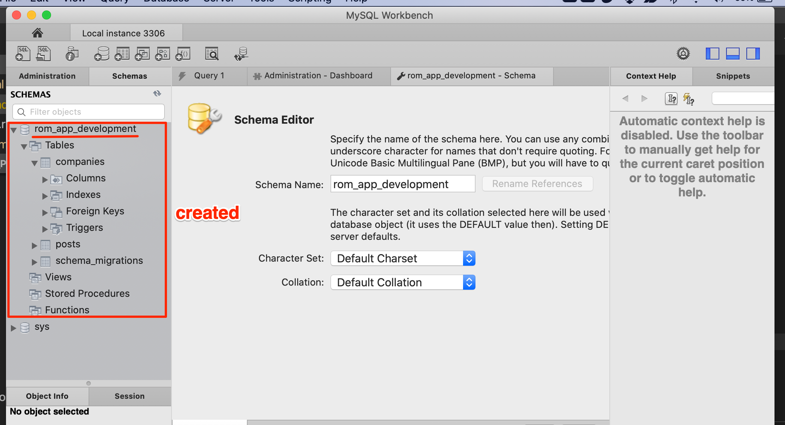

# rom-sample-app

## Installation

## Running

Spin up the docker mysql database:

```bash
➜  rom-sample-app git:(gd/master) docker-compose up
Creating network "rom-sample-app_default" with the default driver
Creating volume "rom-sample-app_mysql" with default driver
Pulling db (mysql:5.7)...
...
Creating rom-sample-app_db_1 ... done
Creating rom-sample-app_app_1 ... done
Attaching to rom-sample-app_db_1, rom-sample-app_app_1
...
...
db_1   | 2020-06-17T21:59:21.847647Z 0 [Note]   - '::' resolves to '::';
db_1   | 2020-06-17T21:59:21.847694Z 0 [Note] Server socket created on IP: '::'.
db_1   | 2020-06-17T21:59:21.851327Z 0 [Warning] Insecure configuration for --pid-file: Location '/var/run/mysqld' in the path is accessible to all OS users. Consider choosing a different directory.
db_1   | 2020-06-17T21:59:21.859578Z 0 [Note] Event Scheduler: Loaded 0 events
db_1   | 2020-06-17T21:59:21.859870Z 0 [Note] mysqld: ready for connections.
db_1   | Version: '5.7.30'  socket: '/var/run/mysqld/mysqld.sock'  port: 3306  MySQL Community Server (GPL)
```

Ensure settings.yml contains all required database configuration.  Note the changes that I made below:

```diff
diff --git a/settings.yml b/settings.yml
index a42739b..c439287 100644
--- a/settings.yml
+++ b/settings.yml
@@ -1,6 +1,6 @@
 development:
   db:
-    host: 'db'
+    host: '127.0.0.1'
     port: 3306
     name: 'rom_app_development'
     username: 'root'
     password: ''
     encoding: 'utf8mb4'
```

Connect to the database via mysql workbench and create the schema:



Do the migration

```bash
➜  rom-sample-app git:(gd/master) ✗ bera --tasks
rake db:clean                           # Perform migration down (erase all data)
rake db:create_migration[name,version]  # Create a migration (parameters: NAME, VERSION)
rake db:migrate[version]                # Migrate the database (options [version_number])]
rake db:reset                           # Perform migration reset (full erase and migration up)
➜  rom-sample-app git:(gd/master) ✗ 
...
...
➜  rom-sample-app git:(gd/master) ✗ bera db:migrate
<= db:migrate executed
➜  rom-sample-app git:(gd/master) ✗ 
```

mysql workbench confirms that the db:migrate was successful:


# References

* [this code base](https://github.com/igkuz/rom-sample-app)
* [supplementary instructions](https://medium.com/@igkuz/how-to-setup-ruby-object-mapper-rom-for-standalone-project-15472fcf31e1)